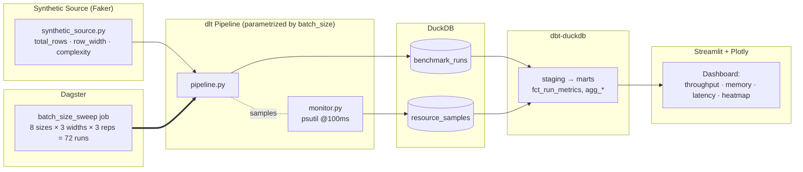

# Batch Size Sweet Spot Benchmark for dlt Pipelines

> **Question:** *"Is a larger batch size always better in a data pipeline?"*
> A controlled benchmark experiment on a `dlt` pipeline using the modern data
> stack — **Dagster + dlt + dbt + DuckDB + Streamlit**.

---

## 1. Purpose & Hypothesis

Many data engineers assume **bigger batch size ⇒ better throughput, always**.
This project tests that belief with a reproducible, controlled experiment.

| ID | Hypothesis | Expectation |
|----|------------|-------------|
| **H1** | Throughput (rows/sec) increases *monotonically* with batch size | ❌ Expect an **inverted‑U**, not a straight line |
| **H2** | Memory grows *linearly* with batch size | ❌ Expect a **non‑linear spike** past a threshold |
| **H3** | A **sweet spot** exists balancing throughput / memory / latency | ✅ Predicted in the **5K–50K rows** range |
| **H4** | Optimal batch size depends on **row width** & data complexity | ✅ Wider rows ⇒ smaller optimal batch |

**Deliverable:** a recommendation matrix — *what batch size to use in which scenario* — backed by data, defensible in a technical interview.

---

## 2. Architecture



<details>
<summary>ASCII fallback</summary>

```
 Faker source ──> dlt pipeline ──(psutil monitor)──> DuckDB ──> dbt ──> Streamlit
      ▲                 ▲                        (runs/         (marts)   (charts)
      └──── Dagster sweep job (72 runs) ─────────  samples)
```
</details>

---

## 3. Quick Start — 100% Local, Zero External Services

> **Nothing here needs a server, container, cloud account, or DB to set up.**
> DuckDB is an embedded file (like SQLite for analytics). `dlt`, Dagster,
> dbt, and Streamlit are all just `pip`-installed Python libraries that run
> on your machine. The whole stack is: **Python + one `.duckdb` file.**

### Local Python (the primary, recommended path)

```powershell
python -m venv .venv; .\.venv\Scripts\Activate.ps1   # isolated env
pip install -r requirements.txt                       # verified lock (recommended)
Copy-Item .env.example .env                           # config (all paths are local files)
python -m dlt_pipelines.pipeline                      # smoke-test one pipeline run
```

> `requirements.txt` is the **verified, frozen environment** this project was
> actually run against (Python 3.11). `pyproject.toml` is also provided for
> `pip install ".[dev]"` if you prefer range-based resolution.

…or with `make`: `make setup`, `make run-single`, `make dashboard`.

| Action | `make` | Plain command (Windows-friendly) |
|--------|--------|-----------------------------------|
| Install | `make setup` | `python -m pip install ".[dev]"` |
| Smoke test | `make run-single` | `python -m dlt_pipelines.pipeline` |
| Full sweep | `make run-benchmark` | `python -m dagster job execute -m dagster_project.definitions -j batch_size_sweep_job` |
| Transform | `make dbt` | `cd dbt_project && dbt build --profiles-dir .` |
| Dashboard | `make dashboard` | `streamlit run dashboard/streamlit_app.py` |

### Docker — *optional*, only if a reviewer prefers it

`docker-compose.yml` is included for convenience but is **never required**.
Skip it entirely and the local path above does everything.

---

## 4. Running the Benchmark

| Step | Command | What it does |
|------|---------|--------------|
| Smoke test | `make run-single` | One pipeline run with `.env` defaults |
| Full sweep | `make run-benchmark` | All **72** runs, sequential, into DuckDB |
| Transform  | `make dbt` | Builds `fct_run_metrics` + `agg_*` marts |
| Analyze    | `make dashboard` | Interactive Plotly dashboard |

The sweep is **sequential by design** — parallel runs would contaminate the
memory/CPU measurements. Expect **2–6 hours** depending on hardware (tune
`BENCHMARK_TOTAL_ROWS` down for a faster dry run).

---

## 5. Tech Stack Rationale

| Tool | Role | Why |
|------|------|-----|
| **Dagster** | Orchestrator | Native `dagster-dlt` integration, asset lineage, sweep jobs, run history UI |
| **dlt** | Ingestion | Python-native, schema evolution, batch size is a first-class knob, built-in trace |
| **dbt-duckdb** | Transform | Percentiles/aggregations in versioned SQL, pairs perfectly with DuckDB |
| **DuckDB** | Storage | Zero-config, file-based, OLAP-fast, minimal benchmark overhead |
| **Streamlit + Plotly** | Viz | Python-native interactive dashboard, one command to serve |
| **psutil** | Monitoring | RSS / CPU% / disk I/O sampling at 100 ms granularity |
| **Docker Compose** | Infra | Clone-and-run reproducibility for reviewers |

---

## 6. Project Layout

```
batch_benchmark/
├── dlt_pipelines/      synthetic source · parametrized pipeline · psutil monitor
├── dagster_project/    assets · sweep job · resources · schedule
├── dbt_project/        staging + marts (fct_run_metrics, agg_*)
├── dashboard/          Streamlit app + Plotly components
├── data/               raw/ (dlt landing) · duckdb/ (benchmark.duckdb)
├── notebooks/          exploratory analysis
└── tests/              synthetic source + pipeline tests
```

---

## 7. Sample Results

> _Screenshots / numbers added after the full sweep is run._

| Artifact | Placeholder |
|----------|-------------|
| Throughput curve (sweet spot annotated) | _TODO: `docs/throughput_curve.png`_ |
| Memory trade-off (Pareto frontier) | _TODO: `docs/memory_tradeoff.png`_ |
| Latency distribution (violin) | _TODO: `docs/latency_violin.png`_ |
| Recommendation matrix | _TODO_ |

---

## 8. Findings

> _Filled in after analysis — answers to H1–H4 with the supporting charts._

- **H1 (monotonic throughput):** _pending_
- **H2 (linear memory):** _pending_
- **H3 (sweet spot):** _pending_
- **H4 (row-width dependence):** _pending_

---

## 9. Future Work

- Add **Postgres / MotherDuck / BigQuery (free tier)** destinations for comparison
- Compare `write_disposition`: `append` vs `replace` vs `merge`
- GitHub Actions CI running a fast smoke sweep
- Deploy the dashboard to Streamlit Cloud
- Real-time monitoring via Prometheus + Grafana
- Blog post / short-form video summarizing the findings

---

## 10. Build Status

This repo is being built incrementally:

- [x] **1. Scaffold** — structure, Docker, README, `pyproject.toml`
- [x] **2. Synthetic data generator** — `dlt_pipelines/synthetic_source.py`
- [x] **3. dlt pipeline** — `dlt_pipelines/pipeline.py`
- [ ] 4. Resource monitor (`monitor.py`)
- [ ] 5. Dagster integration (single batch size)
- [ ] 6. Dagster sweep job (all batch sizes)
- [ ] 7. dbt models
- [ ] 8. Streamlit dashboard
- [ ] 9. Final findings

> Currently paused at step 3 — **test the pipeline standalone before
> continuing to Dagster integration.**

---

_MIT licensed. Built as a data-engineering portfolio project (2026)._
