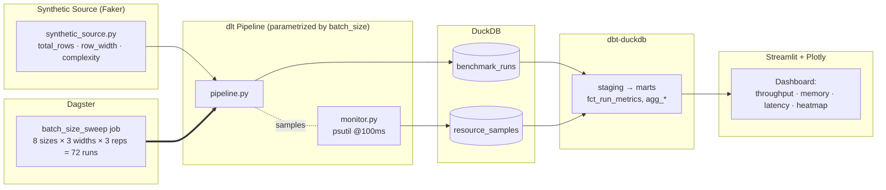

# Batch Size Sweet Spot Benchmark สำหรับ dlt Pipeline

> **คำถามหลัก:** *"ในการทำ data pipeline — batch size ที่ใหญ่กว่า ดีกว่าเสมอจริงไหม?"*
> การทดลอง benchmark แบบ controlled บน `dlt` pipeline ด้วย modern data stack
> — **Dagster + dlt + dbt + DuckDB + Streamlit** — ทั้งหมดรันแบบ **local 100%**

---

## 1. จุดประสงค์ & สมมติฐาน

Data Engineer หลายคนเชื่อว่า **batch ใหญ่ขึ้น ⇒ throughput ดีขึ้น เสมอ**
โปรเจกต์นี้ทดสอบความเชื่อนั้นด้วยการทดลองที่ควบคุมตัวแปรและทำซ้ำได้

| ID | สมมติฐาน | สิ่งที่คาดไว้ |
|----|----------|--------------|
| **H1** | Throughput (rows/sec) เพิ่มขึ้นตาม batch size แบบ *monotonic* | ❌ คาดว่าจะเป็น **inverted-U** ไม่ใช่เส้นตรง |
| **H2** | Memory โตแบบ *linear* ตาม batch size | ❌ คาดว่าจะ **spike แบบ non-linear** เมื่อเกินจุดหนึ่ง |
| **H3** | มี **sweet spot** ที่ trade-off ดีที่สุด (throughput / memory / latency) | ✅ คาดว่าอยู่ช่วง **5K–50K rows** |
| **H4** | Batch size ที่ดีที่สุดขึ้นกับ **row width** และความซับซ้อนข้อมูล | ✅ row ยิ่งกว้าง batch ที่ดีที่สุดยิ่งเล็ก |

**ผลลัพธ์ที่ต้องการ:** ตาราง recommendation — *ควรใช้ batch size เท่าไหร่ ในสถานการณ์ไหน* — ที่มีข้อมูลรองรับ ป้องกันได้ใน technical interview

---

## 2. สถาปัตยกรรม (Architecture)



<details>
<summary>เวอร์ชัน ASCII (เผื่อ Mermaid ไม่ render)</summary>

```
 Faker source ──> dlt pipeline ──(psutil monitor)──> DuckDB ──> dbt ──> Streamlit
      ▲                 ▲                        (runs/         (marts)   (charts)
      └──── Dagster sweep job (72 runs) ─────────  samples)
```
</details>

---

## 3. เริ่มใช้งาน — Local 100%, ไม่ต้องตั้ง service อะไรเพิ่ม

> **ไม่ต้องมี server, container, cloud account หรือ database ให้ตั้งค่าเลย**
> DuckDB เป็นไฟล์ฝังตัว (เหมือน SQLite แต่สาย analytics) ส่วน `dlt`, Dagster,
> dbt, Streamlit เป็นแค่ library Python ที่ `pip install` แล้วรันบนเครื่อง
> สรุป stack ทั้งหมดคือ: **Python + ไฟล์ `.duckdb` ไฟล์เดียว**

### รันด้วย Python (วิธีหลักที่แนะนำ)

```powershell
python -m venv .venv; .\.venv\Scripts\Activate.ps1   # สร้าง env แยก
pip install -r requirements.txt                       # lock ที่ verified แล้ว (แนะนำ)
Copy-Item .env.example .env                           # config (ทุก path เป็นไฟล์ local)
python -m dlt_pipelines.pipeline                      # smoke-test รัน pipeline 1 ครั้ง
```

> `requirements.txt` คือ **environment ที่ถูก freeze และทดสอบมาแล้วจริง**
> (Python 3.11) — โปรเจกต์นี้รันผ่านชุดนี้ ส่วน `pyproject.toml` มีให้เผื่อ
> อยากใช้ `pip install ".[dev]"` แบบ resolve เวอร์ชันเอง

…หรือใช้ `make`: `make setup`, `make run-single`, `make dashboard`

| งาน | `make` | คำสั่งตรง (ใช้ได้บน Windows) |
|------|--------|------------------------------|
| ติดตั้ง | `make setup` | `pip install -r requirements.txt` |
| Smoke test | `make run-single` | `python -m dlt_pipelines.pipeline` |
| Sweep เต็ม | `make run-benchmark` | `python -m dagster job execute -m dagster_project.definitions -j batch_size_sweep_job` |
| Transform | `make dbt` | `cd dbt_project && dbt build --profiles-dir .` |
| Dashboard | `make dashboard` | `streamlit run dashboard/streamlit_app.py` |

### Docker — *ทางเลือกเสริม* เผื่อคนรีวิวอยากใช้

มี `docker-compose.yml` ให้เพื่อความสะดวก แต่ **ไม่จำเป็นต้องใช้** —
ข้ามไปได้เลย วิธีรัน local ด้านบนทำงานครบทุกอย่าง

---

## 4. วิธีรัน Benchmark

| ขั้นตอน | คำสั่ง | ทำอะไร |
|---------|--------|--------|
| Smoke test | `make run-single` | รัน pipeline 1 ครั้งด้วยค่า default ใน `.env` |
| Sweep เต็ม | `make run-benchmark` | รันครบ **72** runs แบบ sequential ลง DuckDB |
| Transform | `make dbt` | สร้าง mart `fct_run_metrics` + `agg_*` |
| วิเคราะห์ | `make dashboard` | Dashboard Plotly แบบ interactive |

Sweep ออกแบบให้รัน **ทีละอันแบบ sequential** ตั้งใจ — ถ้ารัน parallel
จะทำให้ค่า memory/CPU เพี้ยน คาดว่าใช้เวลา **2–6 ชม.** แล้วแต่เครื่อง
(ลด `BENCHMARK_TOTAL_ROWS` ลงเพื่อทดสอบเร็ว ๆ ก่อนได้)

> 🔎 ดูตัวอย่างผลแบบเร็วได้ที่ `notebooks/exploratory_analysis.ipynb`
> (มีคำอธิบายภาษาไทยทุก cell + กราฟ execute ฝังไว้แล้ว — ทำได้ทั้งดึง log
> เดิม และ run mini-sweep จริง)

---

## 5. เหตุผลที่เลือกแต่ละเครื่องมือ

| เครื่องมือ | บทบาท | ทำไมถึงเลือก |
|------------|-------|---------------|
| **Dagster** | Orchestrator | integrate กับ `dlt` ผ่าน `dagster-dlt`, มี asset lineage, sweep job, UI ดู run history |
| **dlt** | Ingestion | Python-native, schema evolution, batch size เป็น knob ระดับ first-class, มี trace ในตัว |
| **dbt-duckdb** | Transform | คำนวณ percentile/aggregate ด้วย SQL ที่ version control ได้ คู่กับ DuckDB ลงตัว |
| **DuckDB** | Storage | zero-config, เป็นไฟล์, OLAP เร็ว, overhead ต่ำเหมาะกับ benchmark |
| **Streamlit + Plotly** | Viz | dashboard Python-native interactive รันคำสั่งเดียว |
| **psutil** | Monitoring | sample RSS / CPU% / disk I/O ทุก 100 ms |
| **Docker Compose** | Infra | clone แล้วรันได้เลย เผื่อคนรีวิว (ไม่บังคับใช้) |

---

## 6. โครงสร้างโปรเจกต์

```
batch_benchmark/
├── dlt_pipelines/      synthetic source · pipeline (parametrized) · psutil monitor
├── dagster_project/    assets · sweep job · resources · schedule
├── dbt_project/        staging + marts (fct_run_metrics, agg_*)
├── dashboard/          Streamlit app + Plotly components
├── data/               raw/ (dlt landing) · duckdb/ (benchmark.duckdb)
├── notebooks/          exploratory analysis (อธิบายภาษาไทย)
└── tests/              test synthetic source + pipeline
```

---

## 7. ตัวอย่างผล (Sample Results)

ผลจาก **mini-sweep จริง** ใน notebook (12K rows/run, row_width=medium):

| batch_size | throughput (rows/sec) |
|-----------:|----------------------:|
| 100 | 1,242 |
| 1,000 | 1,617 |
| **5,000** | **1,967 ← sweet spot** 🏆 |
| 10,000 | 1,591 |
| 50,000 | 1,580 |

กราฟออกมาเป็น **inverted-U จริง** — sweet spot ที่ batch 5,000
เร็วกว่า batch เล็กสุด ~58% และ batch ใหญ่สุดกลับช้าลง ~20% จาก sweet spot

> _Screenshot / ผลจาก sweep เต็ม (72 runs) จะเติมหลังรัน Dagster_

---

## 8. ข้อสรุป (Findings)

> _เติมหลังรัน sweep เต็ม — ตอบ H1–H4 พร้อมกราฟรองรับ_

- **H1 (throughput monotonic):** ❌ *เบื้องต้นถูกหักล้าง* — mini-sweep เห็น inverted-U ชัด
- **H2 (memory linear):** _รอ `monitor.py` (step ถัดไป)_
- **H3 (มี sweet spot):** ✅ *เบื้องต้นพบ* sweet spot ~5K rows (ตรงกับที่คาด 5K–50K)
- **H4 (ขึ้นกับ row width):** _รอ run หลาย row_width เพิ่ม_

---

## 9. งานต่อยอด (Future Work)

- เพิ่ม destination **Postgres / MotherDuck / BigQuery (free tier)** มาเทียบ
- เทียบ `write_disposition`: `append` vs `replace` vs `merge`
- GitHub Actions CI รัน smoke sweep แบบเร็ว
- Deploy dashboard ขึ้น Streamlit Cloud
- Real-time monitoring ด้วย Prometheus + Grafana
- เขียน blog post / คลิปสั้น สรุป findings

---

## 10. สถานะการ Build

โปรเจกต์นี้ build แบบ incremental:

- [x] **1. Scaffold** — โครงสร้าง, Docker, README, `pyproject.toml` + `requirements.txt`
- [x] **2. Synthetic data generator** — `dlt_pipelines/synthetic_source.py` *(ทดสอบแล้ว: 5/15/50 cols)*
- [x] **3. dlt pipeline** — `dlt_pipelines/pipeline.py` *(ทดสอบแล้ว: 50K rows → DuckDB)*
- [x] **+ Notebook วิเคราะห์** — `notebooks/exploratory_analysis.ipynb` *(execute แล้ว เห็น inverted-U)*
- [ ] 4. Resource monitor (`monitor.py`)
- [ ] 5. Dagster integration (batch size เดียวก่อน)
- [ ] 6. Dagster sweep job (ครบทุก batch size)
- [ ] 7. dbt models
- [ ] 8. Streamlit dashboard
- [ ] 9. สรุป findings ฉบับสมบูรณ์

> ตอนนี้หยุดที่ step 3 — **pipeline ทดสอบ standalone ผ่านแล้ว** รอไปต่อ
> Dagster integration (step 4+)

---

_MIT licensed. โปรเจกต์นี้ทำเพื่อเป็น portfolio ด้าน Data Engineering (2026)_
